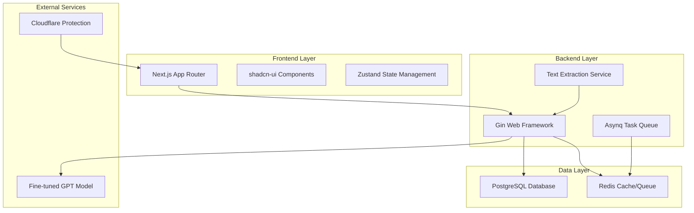

# Design Document

## Overview

PatraSaar is designed as a modern, scalable web application using a monorepo architecture. The system follows a three-tier architecture with a React-based frontend (Next.js), a high-performance backend (Go), and a robust database layer (PostgreSQL). The application integrates with a fine-tuned GPT model for legal document analysis and uses streaming responses to provide real-time user feedback.

## Architecture

### High-Level Architecture



### Monorepo Structure

```
patrasaar/
├── frontend/                 # Next.js application
│   ├── src/
│   │   ├── app/             # App Router pages
│   │   ├── components/      # shadcn-ui components
│   │   ├── lib/            # Utilities and API client
│   │   └── stores/         # Zustand stores
│   ├── public/
│   │   └── assets/         # Logo and favicon
│   └── package.json
├── backend/                 # Go application
│   ├── cmd/
│   │   ├── api/            # Main API server
│   │   └── worker/         # Asynq worker
│   ├── internal/
│   │   ├── handlers/       # HTTP handlers
│   │   ├── services/       # Business logic
│   │   ├── models/         # Data models
│   │   └── config/         # Configuration
│   ├── pkg/                # Shared packages
│   └── go.mod
├── database/               # Database migrations and schemas
│   ├── migrations/
│   └── schemas/
├── docker/                 # Docker configurations
│   ├── Dockerfile.frontend
│   ├── Dockerfile.backend
│   └── docker-compose.yml
├── .github/
│   └── workflows/          # CI/CD pipelines
├── config/                 # Application configuration
│   └── app.yaml           # Core config with PDF limits
├── Makefile               # Development commands
└── README.md
```

## Components and Interfaces

### Frontend Components

#### Core Layout Component
- **Purpose**: Main application shell with responsive two-column layout
- **Technology**: Next.js App Router with client-side state management
- **Key Features**: 
  - Left column for document text display
  - Right column with tabbed interface for summary and Q&A
  - Loading states and error handling

#### File Upload Component
- **Purpose**: Secure file upload with validation
- **Technology**: shadcn-ui Input and Button components
- **Key Features**:
  - File type validation (.txt, .pdf, .docx)
  - Progress indicators
  - Error handling for invalid files

#### Chat Interface Component
- **Purpose**: Interactive Q&A with streaming responses
- **Technology**: shadcn-ui components with real-time updates
- **Key Features**:
  - Message history display
  - Streaming response handling
  - Input validation and submission

### Backend Services

#### Document Processing Service
- **Purpose**: Handle file uploads and text extraction
- **Technology**: Go with specialized libraries (unidoc/unipdf, baliance/gooxml)
- **Interface**:
```go
type DocumentProcessor interface {
    ProcessUpload(file multipart.File, header *multipart.FileHeader) (*Document, error)
    ExtractText(file io.Reader, contentType string) (string, error)
    ValidateFile(header *multipart.FileHeader) error
}
```

#### AI Integration Service
- **Purpose**: Manage communication with fine-tuned GPT model
- **Technology**: Go HTTP client with streaming support
- **Interface**:
```go
type AIService interface {
    GenerateSummary(ctx context.Context, documentText string) (string, error)
    StreamQuery(ctx context.Context, question, context string) (<-chan string, error)
    HandleRateLimit() error
}
```

#### Task Queue Service
- **Purpose**: Manage asynchronous background tasks
- **Technology**: Asynq with Redis
- **Interface**:
```go
type TaskService interface {
    EnqueueSummaryTask(documentID string) error
    ProcessSummaryTask(ctx context.Context, task *asynq.Task) error
    GetTaskStatus(taskID string) (TaskStatus, error)
}
```

### API Endpoints

#### Document Management
- `POST /api/upload` - Upload and process documents
- `GET /api/documents/{id}/status` - Check processing status
- `GET /api/documents/{id}` - Retrieve document details

#### AI Interaction
- `POST /api/documents/{id}/query` - Submit questions with streaming responses
- `GET /api/documents/{id}/summary` - Retrieve generated summary

#### Health and Monitoring
- `GET /api/health` - System health check
- `GET /api/metrics` - Application metrics

## Data Models

### Database Schema

#### Documents Table
```sql
CREATE TABLE documents (
    id UUID PRIMARY KEY DEFAULT gen_random_uuid(),
    filename TEXT NOT NULL,
    raw_text TEXT NOT NULL,
    summary TEXT,
    status VARCHAR(20) DEFAULT 'PENDING',
    created_at TIMESTAMP DEFAULT CURRENT_TIMESTAMP,
    updated_at TIMESTAMP DEFAULT CURRENT_TIMESTAMP,
    file_size INTEGER,
    content_type VARCHAR(100)
);

CREATE INDEX idx_documents_status ON documents(status);
CREATE INDEX idx_documents_created_at ON documents(created_at);
```

#### Chat Sessions Table (Optional for persistence)
```sql
CREATE TABLE chat_sessions (
    id UUID PRIMARY KEY DEFAULT gen_random_uuid(),
    document_id UUID REFERENCES documents(id) ON DELETE CASCADE,
    messages JSONB NOT NULL,
    created_at TIMESTAMP DEFAULT CURRENT_TIMESTAMP
);
```

### Go Data Models

```go
type Document struct {
    ID          string    `json:"id" db:"id"`
    Filename    string    `json:"filename" db:"filename"`
    RawText     string    `json:"raw_text" db:"raw_text"`
    Summary     *string   `json:"summary" db:"summary"`
    Status      string    `json:"status" db:"status"`
    CreatedAt   time.Time `json:"created_at" db:"created_at"`
    UpdatedAt   time.Time `json:"updated_at" db:"updated_at"`
    FileSize    int64     `json:"file_size" db:"file_size"`
    ContentType string    `json:"content_type" db:"content_type"`
}

type ChatMessage struct {
    Role    string `json:"role"`    // "user" or "assistant"
    Content string `json:"content"`
}

type QueryRequest struct {
    Question string `json:"question" binding:"required"`
}

type QueryResponse struct {
    Answer string `json:"answer"`
}
```

### Frontend State Models

```typescript
interface DocumentState {
  documentId: string | null;
  filename: string;
  rawText: string;
  summary: string | null;
  status: 'PENDING' | 'PROCESSING' | 'COMPLETED' | 'FAILED';
  chatHistory: ChatMessage[];
  isLoading: boolean;
  error: string | null;
}

interface ChatMessage {
  role: 'user' | 'assistant';
  content: string;
  timestamp: Date;
}
```

## Error Handling

### Frontend Error Handling
- **Network Errors**: Retry logic with exponential backoff
- **Validation Errors**: Real-time form validation with user-friendly messages
- **Stream Interruptions**: Graceful handling of connection drops during AI responses
- **File Upload Errors**: Clear feedback for file size, type, and processing errors

### Backend Error Handling
- **File Processing Errors**: Detailed logging with user-safe error messages
- **AI Service Errors**: Fallback responses and rate limit handling
- **Database Errors**: Transaction rollbacks and connection pool management
- **Task Queue Errors**: Dead letter queues and retry mechanisms

### Error Response Format
```go
type ErrorResponse struct {
    Error   string `json:"error"`
    Code    string `json:"code"`
    Details string `json:"details,omitempty"`
}
```

## Testing Strategy

### Frontend Testing
- **Unit Tests**: Jest and React Testing Library for components
- **Integration Tests**: API integration testing with mock services
- **E2E Tests**: Playwright for critical user flows
- **Accessibility Tests**: axe-core integration for WCAG compliance

### Backend Testing
- **Unit Tests**: Go standard testing package with testify
- **Integration Tests**: Database integration with test containers
- **API Tests**: HTTP endpoint testing with real database
- **Load Tests**: Concurrent request handling and performance benchmarks

### Database Testing
- **Migration Tests**: Forward and backward migration validation
- **Performance Tests**: Query optimization and indexing validation
- **Data Integrity Tests**: Constraint and relationship validation

### Test Coverage Goals
- Frontend: >80% code coverage
- Backend: >85% code coverage
- Critical paths: 100% coverage (file upload, AI integration, security)

## Security Considerations

### Input Validation
- File type and size validation on both frontend and backend
- Content-type verification to prevent file type spoofing
- Malicious file detection using file signature validation

### Data Protection
- No persistent storage of sensitive user data beyond session
- Secure file handling with temporary storage cleanup
- Database connection encryption and parameterized queries

### API Security
- Rate limiting per IP and per session
- CORS configuration for frontend domain only
- Request size limits to prevent DoS attacks
- Input sanitization for all user-provided data

### Infrastructure Security
- Docker container security with non-root users
- Environment variable management for secrets
- Cloudflare integration for DDoS protection and WAF
- HTTPS enforcement with proper certificate management

## Performance Optimization

### Frontend Performance
- Code splitting with Next.js dynamic imports
- Image optimization with Next.js Image component
- Client-side caching with Zustand persistence
- Streaming responses for real-time AI feedback

### Backend Performance
- Connection pooling for database and Redis
- Concurrent request handling with Go goroutines
- Efficient text extraction with streaming parsers
- Response compression and caching headers

### Database Performance
- Proper indexing strategy for common queries
- Connection pooling with pgx
- Query optimization for large text documents
- Archival strategy for old documents

## Deployment Architecture

### Development Environment
- Hot reloading for all components via Makefile
- Local Docker Compose for service dependencies
- Environment-specific configuration management
- Integrated testing and linting workflows

### Production Environment
- Multi-stage Docker builds for optimized images
- Kubernetes deployment with horizontal pod autoscaling
- Redis cluster for high availability task queuing
- PostgreSQL with read replicas for scaling
- CDN integration for static assets

### CI/CD Pipeline
- Automated testing on pull requests
- Security scanning with dependency checks
- Multi-environment deployment (staging, production)
- Rollback capabilities and health monitoring