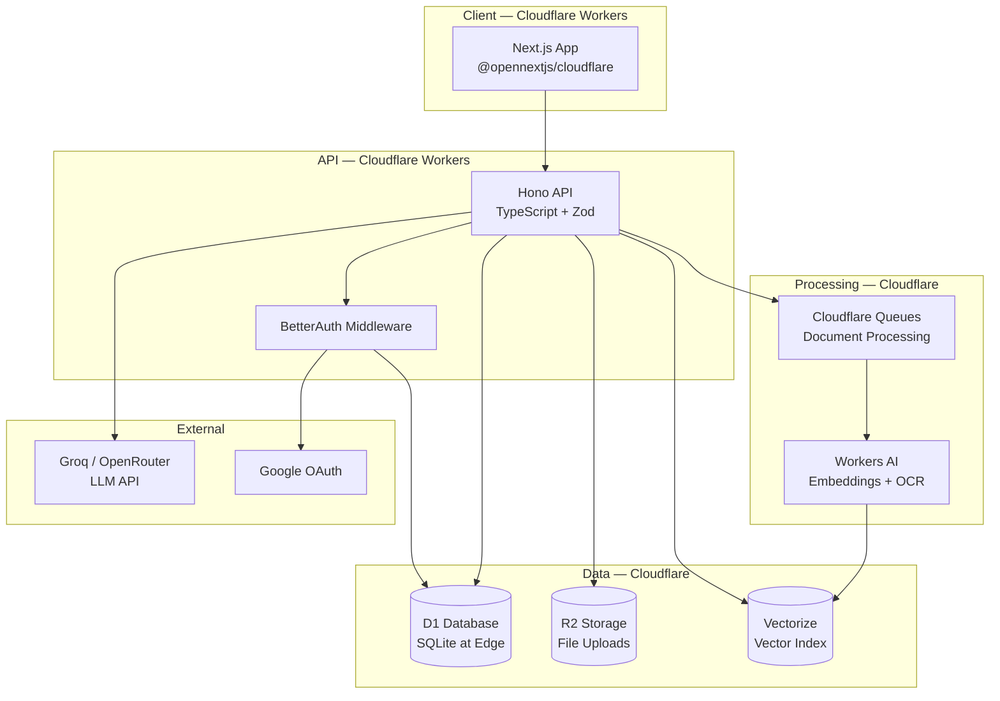
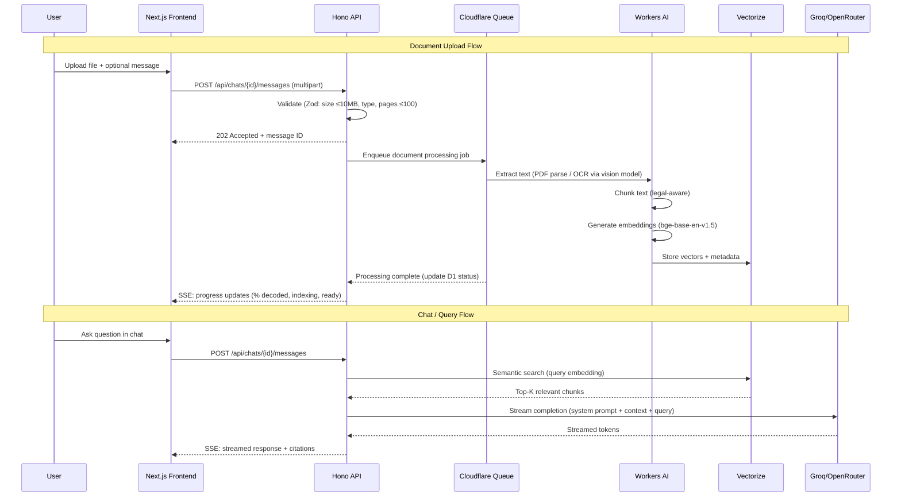
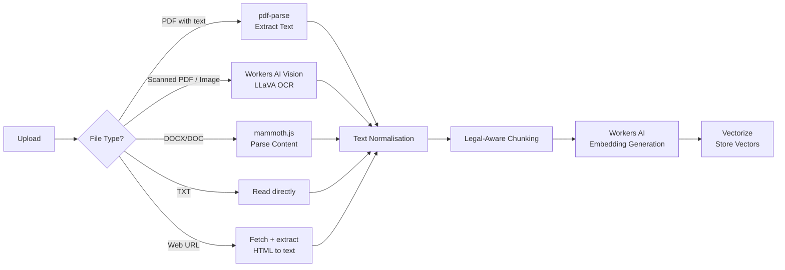
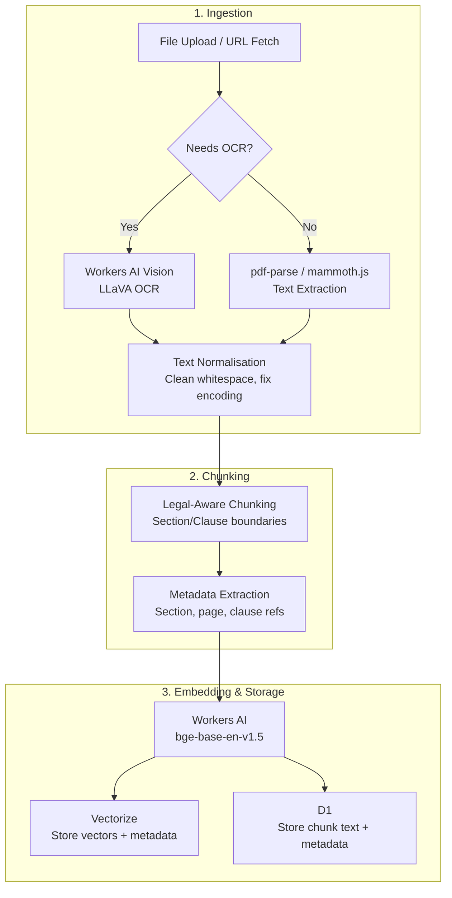
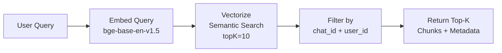
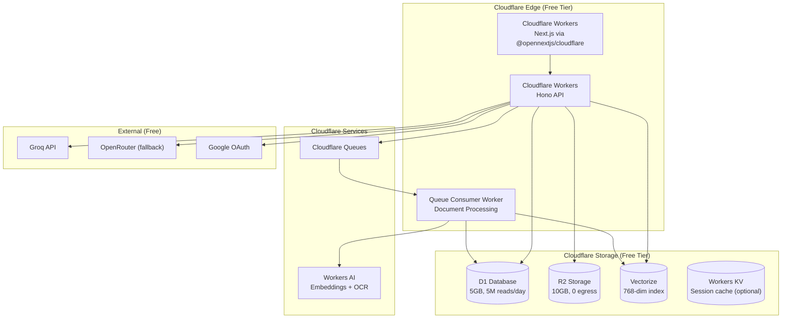
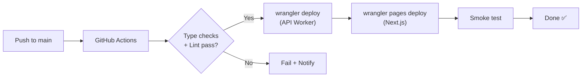
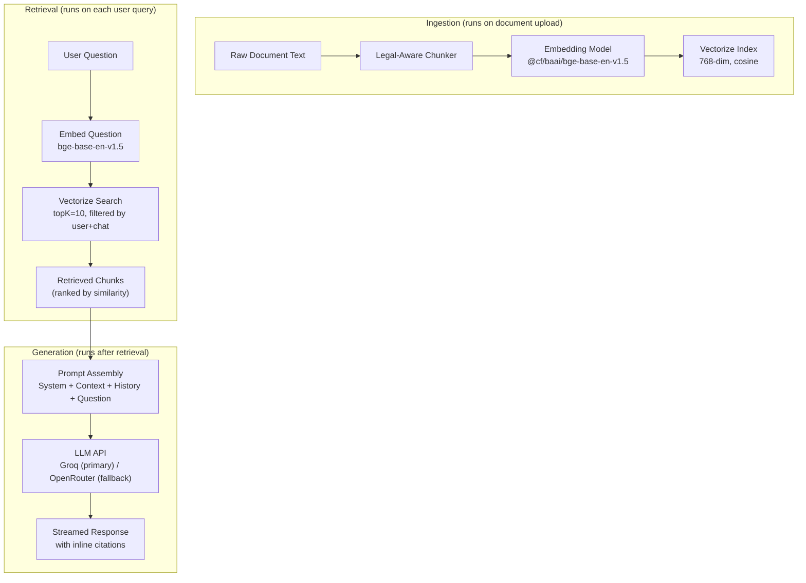

# PatraSaar — System Design Architecture & Implementation Plan

> **Legal clarity, distilled.**
> An AI-powered platform for simplifying Indian legal documents using Retrieval-Augmented Generation (RAG), hosted entirely on Cloudflare's edge infrastructure.

---

## Table of Contents
1. [Executive Summary](#1-executive-summary)
2. [System Architecture Overview](#2-system-architecture-overview)
3. [Component Deep Dive](#3-component-deep-dive)
4. [Data Models & Schema](#4-data-models--schema)
5. [RAG Pipeline Architecture](#5-rag-pipeline-architecture)
6. [API Specifications](#6-api-specifications)
7. [Frontend Architecture](#7-frontend-architecture)
8. [Design System & Aesthetics](#8-design-system--aesthetics)
9. [Security & Compliance](#9-security--compliance)
10. [Infrastructure & Deployment](#10-infrastructure--deployment)
11. [Implementation Phases](#11-implementation-phases)
12. [AI / LLM Technical Documentation](#12-ai--llm-technical-documentation)
13. [Verification Plan](#13-verification-plan)

---

## 1. Executive Summary

### 1.1 Vision
PatraSaar is a free legal-AI platform that democratizes legal comprehension for Indian citizens. Users upload legal documents (PDF, TXT, DOC, DOCX, or web links) and converse with an AI that simplifies complex legal jargon — backed by source citations — in a ChatGPT-style streaming interface.

### 1.2 Key Objectives
- **Document Simplification**: Transform complex legal text into plain language
- **Grounded AI Responses**: Every explanation backed by authentic legal sources via RAG
- **Accessibility**: Free to use, responsive on all screen sizes
- **Compliance**: Strict legal disclaimers — never provides legal advice

### 1.3 Target Scale
- **Current**: < 500 users. No micro-optimisation — keep it simple, fast and maintainable.
- **Future**: Full rewrite planned before broader public access.

### 1.4 Technology Stack (100% Free Tier)

| Layer | Technology | Free Tier |
|-------|------------|-----------|
| **Frontend** | Next.js (latest) on Cloudflare Workers via `@opennextjs/cloudflare` | ✅ Cloudflare Pages/Workers free |
| **Backend Framework** | Hono (TypeScript) on Cloudflare Workers | ✅ Free |
| **Validation** | Zod | ✅ OSS |
| **Database** | Cloudflare D1 (SQLite at edge) | ✅ 5GB storage, 5M reads/day |
| **Vector DB** | Cloudflare Vectorize | ✅ Free tier for prototyping |
| **File Storage** | Cloudflare R2 | ✅ 10GB, zero egress fees |
| **Auth** | BetterAuth (OSS, TypeScript) + Google OAuth | ✅ Free, self-hosted |
| **LLM** | Groq (primary) / OpenRouter (fallback) | ✅ Free tiers |
| **Embeddings** | Cloudflare Workers AI (`@cf/baai/bge-base-en-v1.5`) | ✅ Free on Workers |
| **OCR** | Cloudflare Workers AI (LLaVA/vision model) + pdf-parse | ✅ Free |
| **Queue** | Cloudflare Queues | ✅ Free tier |
| **Compiler** | Standard `tsc` (ts-go is still experimental as of Feb 2026, not yet stable for production) | ✅ Free |

---

## 2. System Architecture Overview

### 2.1 High-Level Architecture



### 2.2 Data Flow — Document Upload & Chat



---

## 3. Component Deep Dive

### 3.1 Authentication — BetterAuth

**Why BetterAuth:**
- TypeScript-native, framework-agnostic, fully open-source
- First-class Hono integration via `betterAuth.handler`
- Native Cloudflare D1 adapter (SQLite)
- Built-in Google OAuth social provider
- Session management, CSRF protection, secure cookies
- Zero cost — self-hosted within your Workers

**Setup:**
```
POST /api/auth/* → BetterAuth handler mounted on Hono
```

**Auth Flow:**
1. User clicks "Sign in with Google"
2. Redirect to Google OAuth consent screen
3. Callback returns to `/api/auth/callback/google`
4. BetterAuth creates session in D1, sets secure httpOnly cookie
5. Frontend reads session via `/api/auth/get-session`

**Required Secrets:**
- `BETTER_AUTH_SECRET` — random 32+ char string
- `GOOGLE_CLIENT_ID` — from Google Cloud Console
- `GOOGLE_CLIENT_SECRET` — from Google Cloud Console

### 3.2 Document Service

**Supported Formats:**
- PDF (native text + scanned/image-based)
- DOCX
- DOC (converted server-side)
- TXT
- Web URL (fetched, HTML-to-text extracted)

**File Limits:**
- Maximum file size: **10 MB**
- Maximum pages: **100 pages**
- Whichever limit is hit first

**Processing Pipeline:**



### 3.3 Chat & Query Service

The app follows a **ChatGPT-style interface**:
- Users create "chats" (conversations)
- Each chat can have one or more uploaded documents as context
- Messages are interleaved: user messages (with optional file attachments) and assistant responses
- Responses are **streamed** via Server-Sent Events (SSE)
- Chat history appears in the sidebar

**Query Processing:**
1. User sends message in chat
2. Query embedded via Workers AI
3. Semantic search on Vectorize (scoped to chat's documents)
4. Top-K chunks retrieved as context
5. LLM prompt assembled: system prompt + retrieved context + chat history + user query
6. Response streamed back via SSE with inline citations
7. Message + response persisted to D1

### 3.4 Queue & Progress Service

**Cloudflare Queues** handles document processing asynchronously:
- Upload triggers a queue message
- Consumer Worker processes: parse → chunk → embed → store
- Progress updates written to D1 (`processing_jobs` table)
- Frontend polls `/api/jobs/{id}/status` for progress:
  - `queued` → `parsing` (30%) → `chunking` (60%) → `embedding` (80%) → `ready` (100%)
  - On failure: `failed` with error message

---

## 4. Data Models & Schema

### 4.1 Cloudflare D1 Schema (SQLite)

```sql
-- Users (managed by BetterAuth, extended with app fields)
-- BetterAuth auto-creates: user, session, account tables
-- We add app-specific tables below:

-- Chats Table
CREATE TABLE chats (
    id TEXT PRIMARY KEY,  -- nanoid
    user_id TEXT NOT NULL,
    title TEXT DEFAULT 'New Chat',
    created_at TEXT DEFAULT (datetime('now')),
    updated_at TEXT DEFAULT (datetime('now')),
    FOREIGN KEY (user_id) REFERENCES user(id) ON DELETE CASCADE
);

-- Messages Table
CREATE TABLE messages (
    id TEXT PRIMARY KEY,  -- nanoid
    chat_id TEXT NOT NULL,
    role TEXT NOT NULL CHECK (role IN ('user', 'assistant')),
    content TEXT NOT NULL,
    citations TEXT,  -- JSON array of citation objects
    tokens_used INTEGER,
    created_at TEXT DEFAULT (datetime('now')),
    FOREIGN KEY (chat_id) REFERENCES chats(id) ON DELETE CASCADE
);

-- Documents Table
CREATE TABLE documents (
    id TEXT PRIMARY KEY,  -- nanoid
    chat_id TEXT NOT NULL,
    message_id TEXT,  -- the user message that uploaded this doc
    user_id TEXT NOT NULL,
    original_filename TEXT NOT NULL,
    file_type TEXT NOT NULL,       -- pdf, docx, doc, txt, url
    file_size INTEGER,             -- bytes
    page_count INTEGER,
    r2_key TEXT,                    -- R2 object key
    source_url TEXT,               -- if uploaded via URL

    -- Processing
    status TEXT DEFAULT 'pending' CHECK (status IN ('pending','processing','ready','failed')),
    raw_text TEXT,                  -- extracted full text
    chunk_count INTEGER DEFAULT 0,
    error_message TEXT,

    created_at TEXT DEFAULT (datetime('now')),
    processed_at TEXT,
    FOREIGN KEY (chat_id) REFERENCES chats(id) ON DELETE CASCADE,
    FOREIGN KEY (user_id) REFERENCES user(id) ON DELETE CASCADE
);

-- Document Chunks (metadata only — vectors live in Vectorize)
CREATE TABLE document_chunks (
    id TEXT PRIMARY KEY,  -- nanoid, also used as vector ID in Vectorize
    document_id TEXT NOT NULL,
    chunk_index INTEGER NOT NULL,
    content TEXT NOT NULL,
    metadata TEXT,  -- JSON: { section, page, clause_ref }
    created_at TEXT DEFAULT (datetime('now')),
    FOREIGN KEY (document_id) REFERENCES documents(id) ON DELETE CASCADE
);

-- Processing Jobs (for progress tracking)
CREATE TABLE processing_jobs (
    id TEXT PRIMARY KEY,  -- nanoid
    document_id TEXT NOT NULL,
    status TEXT DEFAULT 'queued' CHECK (status IN ('queued','parsing','chunking','embedding','ready','failed')),
    progress INTEGER DEFAULT 0,   -- 0-100
    error_message TEXT,
    created_at TEXT DEFAULT (datetime('now')),
    updated_at TEXT DEFAULT (datetime('now')),
    FOREIGN KEY (document_id) REFERENCES documents(id) ON DELETE CASCADE
);

-- Usage Tracking
CREATE TABLE usage_tracking (
    id TEXT PRIMARY KEY,
    user_id TEXT NOT NULL,
    action_type TEXT NOT NULL,  -- 'upload', 'query'
    metadata TEXT,              -- JSON
    created_at TEXT DEFAULT (datetime('now')),
    FOREIGN KEY (user_id) REFERENCES user(id) ON DELETE CASCADE
);

-- Indexes
CREATE INDEX idx_chats_user ON chats(user_id);
CREATE INDEX idx_chats_updated ON chats(updated_at);
CREATE INDEX idx_messages_chat ON messages(chat_id);
CREATE INDEX idx_documents_chat ON documents(chat_id);
CREATE INDEX idx_documents_user ON documents(user_id);
CREATE INDEX idx_documents_status ON documents(status);
CREATE INDEX idx_chunks_document ON document_chunks(document_id);
CREATE INDEX idx_jobs_document ON processing_jobs(document_id);
CREATE INDEX idx_usage_user ON usage_tracking(user_id);
```

### 4.2 Vectorize Index Schema

```json
{
  "index_name": "patrasaar-docs",
  "dimensions": 768,
  "metric": "cosine",
  "metadata_fields": {
    "document_id": "string",
    "chat_id": "string",
    "user_id": "string",
    "chunk_index": "number",
    "section": "string",
    "page": "number"
  }
}
```

**Embedding Model:** `@cf/baai/bge-base-en-v1.5` (768 dimensions) — runs free on Workers AI.

---

## 5. RAG Pipeline Architecture

### 5.1 Ingestion Pipeline



### 5.2 Legal-Aware Chunking Strategy

```typescript
// Pseudocode — legal-aware chunking
const SECTION_PATTERNS = [
  /^Section\s+\d+/,
  /^Article\s+\d+/,
  /^Clause\s+\d+/,
  /^\d+\.\s+[A-Z]/,
  /^CHAPTER\s+/i,
  /^SCHEDULE\s+/i,
];

const CHUNK_CONFIG = {
  maxTokens: 512,
  overlapTokens: 50,
  respectBoundaries: true,  // never split mid-section if possible
};

// 1. Identify section boundaries using regex patterns
// 2. Create chunks respecting those boundaries
// 3. Large sections split with overlap
// 4. Each chunk tagged with metadata: section, page, clause_ref
```

### 5.3 Retrieval Flow



**Notes:**
- Vectorize handles semantic similarity search natively.
- We filter results by `chat_id` and `user_id` metadata to ensure document isolation between users.
- No BM25/hybrid search for MVP — Vectorize semantic search is sufficient for <500 users. Can add later.

### 5.4 Generation — Prompt Template

```markdown
## System Prompt

You are PatraSaar, an AI assistant specialized in simplifying Indian legal documents.
Your role is to help users understand legal text. You do NOT provide legal advice.

### Rules:
1. Explain legal terms in simple, everyday Hindi-English (Hinglish) or English.
2. Every claim MUST cite the specific section, clause, or page from the provided context.
3. If uncertain, say "I'm not certain about this based on the document."
4. Always end with: "⚖️ This is for informational purposes only, not legal advice."
5. Highlight risks and obligations clearly.
6. Format responses with clear headings and bullet points.

### Retrieved Context:
{retrieved_chunks}

### Chat History:
{recent_messages}

### User Question:
{user_query}
```

### 5.5 Streaming Response

- LLM response streamed via **Server-Sent Events (SSE)** from Hono API to frontend.
- Groq API supports streaming natively (`stream: true`).
- OpenRouter also supports streaming as fallback.
- Frontend renders tokens as they arrive using a simple SSE client.

---

## 6. API Specifications

### 6.1 Hono API Routes

All routes prefixed with `/api`. Auth routes handled by BetterAuth. App routes protected by BetterAuth session middleware.

#### Auth (BetterAuth — auto-mounted)
```yaml
GET  /api/auth/get-session      # Get current session
POST /api/auth/sign-in/social   # Initiate Google OAuth
GET  /api/auth/callback/google  # OAuth callback
POST /api/auth/sign-out         # Sign out
```

#### Chats
```yaml
GET    /api/chats:
  description: List user's chats (sidebar)
  response: { chats: Chat[] }   # ordered by updated_at DESC

POST   /api/chats:
  description: Create new chat
  response: { chat: Chat }

GET    /api/chats/{id}:
  description: Get chat with messages
  response: { chat: Chat, messages: Message[] }

DELETE /api/chats/{id}:
  description: Delete chat + all associated documents/vectors
  response: { success: boolean }

PATCH  /api/chats/{id}:
  description: Rename chat
  body: { title: string }
  response: { chat: Chat }
```

#### Messages
```yaml
POST /api/chats/{id}/messages:
  description: Send message (with optional file upload)
  body: multipart/form-data
    content: string (optional text message)
    file: File (optional, ≤10MB, pdf/txt/doc/docx)
    url: string (optional, web URL to fetch)
  response: SSE stream
    event: progress  → { status, progress, message }
    event: token     → { content }
    event: citations → { citations: Citation[] }
    event: done      → { messageId }
```

#### Jobs (Document Processing Status)
```yaml
GET /api/jobs/{id}/status:
  description: Poll document processing progress
  response:
    status: "queued" | "parsing" | "chunking" | "embedding" | "ready" | "failed"
    progress: number (0-100)
    error: string | null
```

### 6.2 Real-time Updates

**Server-Sent Events (SSE)** used for:
1. **Document processing progress** — polling `/api/jobs/{id}/status` every 2s
2. **LLM response streaming** — SSE stream from `POST /api/chats/{id}/messages`

No WebSockets needed — SSE is simpler, works perfectly on Cloudflare Workers, and sufficient for this use case.

---

## 7. Frontend Architecture

### 7.1 Application Structure (Next.js App Router)

```
patrasaar/
├── app/
│   ├── (marketing)/
│   │   ├── page.tsx            # Landing page (Server Component)
│   │   ├── about/page.tsx
│   │   └── layout.tsx          # Marketing layout
│   ├── (auth)/
│   │   ├── login/page.tsx
│   │   └── layout.tsx          # Minimal auth layout
│   ├── (app)/
│   │   ├── chat/
│   │   │   ├── page.tsx        # New chat view
│   │   │   └── [id]/page.tsx   # Chat conversation view
│   │   ├── layout.tsx          # App shell: sidebar + main
│   │   └── loading.tsx
│   ├── layout.tsx              # Root layout (fonts, providers)
│   └── globals.css             # Design tokens + base styles
│
├── components/
│   ├── chat/
│   │   ├── ChatSidebar.tsx     # Chat history list
│   │   ├── ChatWindow.tsx      # Message thread
│   │   ├── MessageBubble.tsx   # Individual message
│   │   ├── ChatInput.tsx       # Text input + file attach + send
│   │   ├── FileUploadZone.tsx  # Drag-and-drop file area
│   │   ├── StreamingResponse.tsx
│   │   └── CitationTag.tsx
│   ├── marketing/
│   │   ├── Hero.tsx
│   │   ├── Features.tsx
│   │   └── Footer.tsx
│   ├── layout/
│   │   ├── AppShell.tsx
│   │   └── MobileNav.tsx
│   └── ui/                     # Custom primitives (no component kits)
│       ├── Button.tsx
│       ├── Input.tsx
│       ├── Dialog.tsx
│       └── Spinner.tsx
│
├── lib/
│   ├── api.ts                  # Fetch wrapper for Hono API
│   ├── auth-client.ts          # BetterAuth client SDK
│   ├── sse.ts                  # SSE client for streaming
│   └── utils.ts
│
├── hooks/
│   ├── useChat.ts
│   ├── useSession.ts
│   └── useFileUpload.ts
│
├── types/
│   └── index.ts                # Shared TypeScript types
│
├── public/
│   └── fonts/                  # Self-hosted via next/font
│
├── next.config.ts
├── wrangler.jsonc              # Cloudflare config
└── package.json
```

### 7.2 Key Views

#### Landing Page
- Bold editorial typography, asymmetric layout
- Animated reveal on scroll (Framer Motion stagger)
- "Sign in with Google" CTA — no registration form
- Feature highlights: Upload → AI Simplifies → Get Answers
- Legal disclaimer in footer
- **No pricing section** (free app)

#### Chat View (Primary Interface)
```
┌──────────────────────────────────────────────────────────────┐
│  [☰]  PatraSaar                              [User Avatar ▾] │
├────────────┬─────────────────────────────────────────────────┤
│            │                                                 │
│  CHATS     │   ┌─────────────────────────────────────────┐   │
│  ────────  │   │  🤖 Assistant                           │   │
│  + New     │   │  Welcome! Upload a legal document and   │   │
│            │   │  I'll help you understand it.            │   │
│  ▸ Rental  │   └─────────────────────────────────────────┘   │
│    Agree.  │                                                 │
│  ▸ FIR     │   ┌─────────────────────────────────────────┐   │
│    Copy    │   │  👤 You                                  │   │
│  ▸ Court   │   │  📎 rental_agreement.pdf                │   │
│    Order   │   │  What are the exit clauses?              │   │
│            │   └─────────────────────────────────────────┘   │
│            │                                                 │
│            │   ┌─────────────────────────────────────────┐   │
│            │   │  🤖 Assistant                           │   │
│            │   │  Based on the document, there are 3     │   │
│            │   │  exit clauses... [Section 12.1]         │   │
│            │   │  ⚖️ Informational only, not legal advice│   │
│            │   └─────────────────────────────────────────┘   │
│            │                                                 │
│            │  ┌───────────────────────────────────┬──┬──┐    │
│            │  │ Ask about your document...        │📎│ →│    │
│            │  └───────────────────────────────────┴──┴──┘    │
├────────────┴─────────────────────────────────────────────────┤
│  Processing: rental_agreement.pdf ████████░░ 80% Embedding   │
└──────────────────────────────────────────────────────────────┘
```

---

## 8. Design System & Aesthetics

### 8.1 Typography (via `next/font`)

```typescript
// app/layout.tsx
import { Fraunces, Instrument_Sans, JetBrains_Mono } from 'next/font/google'

const heading = Fraunces({
  subsets: ['latin'],
  variable: '--font-heading',
  display: 'swap',
  weight: ['400', '500', '700', '900'],
})

const body = Instrument_Sans({
  subsets: ['latin'],
  variable: '--font-body',
  display: 'swap',
})

const mono = JetBrains_Mono({
  subsets: ['latin'],
  variable: '--font-mono',
  display: 'swap',
  weight: ['400', '500'],
})
```

**Rationale:** Fraunces is an editorial variable serif with optical weight — gives legal gravitas without being stuffy. Instrument Sans is a sharp, modern neo-grotesk that contrasts well. JetBrains Mono for citations and code-like references.

### 8.2 Color Tokens (CSS Custom Properties)

```css
/* globals.css */
:root {
  /* --- Surface & Background --- */
  --bg-root: #0C0A09;            /* near-black, warm charcoal */
  --bg-surface: #1A1816;         /* card / panel background */
  --bg-elevated: #262220;        /* sidebar, dialogs */
  --bg-accent-subtle: #2A2118;   /* warm tint for highlights */

  /* --- Text --- */
  --text-primary: #F5F0EB;       /* warm off-white, like aged paper */
  --text-secondary: #A89F94;     /* muted warm gray */
  --text-muted: #6B6056;
  --text-inverse: #0C0A09;

  /* --- Brand / Accent — Burnt Sienna & Gold --- */
  --accent-primary: #C67A3C;     /* burnt sienna — like court seal wax */
  --accent-primary-hover: #D48B4F;
  --accent-secondary: #D4A853;   /* old gold — like manuscript headers */
  --accent-glow: rgba(198, 122, 60, 0.15);

  /* --- Semantic --- */
  --color-success: #5B9A6F;      /* muted sage green */
  --color-warning: #D4A853;      /* gold doubles as warning */
  --color-danger: #C75450;       /* muted vermillion — like red ink stamps */
  --color-info: #7B9EBD;         /* steel blue */

  /* --- Citation & Legal --- */
  --color-citation: #D4A853;
  --color-risk-high: #C75450;
  --color-risk-medium: #D4A853;
  --color-risk-low: #5B9A6F;

  /* --- Borders & Dividers --- */
  --border-subtle: rgba(168, 159, 148, 0.12);
  --border-strong: rgba(168, 159, 148, 0.25);

  /* --- Texture --- */
  --grain-opacity: 0.03;         /* faint paper grain overlay */
}
```

**Design Inspiration:** Indian legal manuscripts, court stamps and wax seals, archival paper, ink and copper plate engravings. The palette avoids generic SaaS blues/purples in favour of warm earth tones that feel culturally grounded.

### 8.3 Background & Atmosphere

- **Root background**: Deep warm charcoal (`#0C0A09`), not pure black
- **Grain texture**: Subtle SVG noise overlay at 3% opacity — simulates aged paper
- **Radial gradient**: Faint warm glow behind hero content areas
- **Section transitions**: Tone shifts between sections (slightly different bg tints)
- No flat white backgrounds anywhere

### 8.4 Motion (Framer Motion)

```typescript
// Orchestrated page reveal — not scattered micro-interactions
const staggerContainer = {
  hidden: { opacity: 0 },
  show: {
    opacity: 1,
    transition: { staggerChildren: 0.08, delayChildren: 0.1 }
  }
}

const fadeUp = {
  hidden: { opacity: 0, y: 16, filter: 'blur(4px)' },
  show: {
    opacity: 1, y: 0, filter: 'blur(0px)',
    transition: { duration: 0.5, ease: [0.22, 1, 0.36, 1] }
  }
}
```

**Principles:**
- Single orchestrated page-load reveal per route transition
- Subtle opacity + blur entrances reinforce trust
- No bouncy animations, no random hover gimmicks
- Chat message entry: gentle slide-up fade
- Streaming text: immediate render, no per-character animation

### 8.5 Layout Principles

- **Server Components by default** — Client Components only for chat input, streaming, file upload
- **Asymmetric whitespace** — large typography blocks breathe
- **No Shadcn/UI or heavy component libraries** — custom primitives match the design language
- **Sidebar**: collapsible on mobile, persistent on desktop
- **No rounded-2xl everywhere** — mix sharp and subtle radius intentionally

---

## 9. Security & Compliance

### 9.1 Security Measures

| Area | Implementation |
|------|----------------|
| **Authentication** | BetterAuth: secure httpOnly cookies, CSRF tokens, session rotation |
| **Authorisation** | Every API route checks session + `user_id` ownership of resources |
| **Input Validation** | Zod schemas on every Hono route (body, params, query) |
| **File Validation** | MIME type check, magic bytes verification, size ≤10MB, pages ≤100 |
| **Rate Limiting** | Cloudflare WAF rate rules + per-user limits in D1 |
| **Data Isolation** | All queries scoped by `user_id` — no cross-user data leakage |
| **Secrets** | Cloudflare Workers secrets (encrypted at rest), never in code |
| **Transport** | TLS 1.3 enforced by Cloudflare edge |
| **Headers** | Strict CSP, X-Frame-Options, X-Content-Type-Options via Hono middleware |
| **SQL Injection** | D1 prepared statements with bound parameters only |
| **XSS** | React's default escaping + sanitised markdown rendering |
| **CORS** | Strict origin whitelist for API routes |

### 9.2 Legal Disclaimers

```typescript
const LEGAL_DISCLAIMER = `⚖️ This is for informational purposes only, not legal advice. 
For specific legal matters, consult a qualified lawyer.`;
```

Appended to every AI response. Shown permanently in footer.

### 9.3 Data Privacy

- Users can delete their account → cascade deletes all chats, docs, vectors
- No analytics tracking beyond basic usage counts
- No cross-user data access possible (all queries scoped)
- Documents stored in R2 with user-scoped key prefixes
- Vectors filtered by `user_id` metadata in every Vectorize query

### 9.4 Practical Scope

> [!NOTE]
> For <500 users, we do NOT need: penetration testing, SOC2, GDPR DPA, or enterprise security audits. The measures above are industry-standard for a free MVP. Do not over-engineer security — the above is sufficient.

---

## 10. Infrastructure & Deployment

### 10.1 Cloudflare Architecture



### 10.2 Free Tier Limits

| Service | Free Tier | Comfortable for <500 Users? |
|---------|-----------|----------------------------|
| **Cloudflare Workers** | 100K requests/day | ✅ Yes |
| **Cloudflare D1** | 5M reads/day, 100K writes/day, 5GB | ✅ Yes |
| **Cloudflare R2** | 10GB storage, 1M Class A, 10M Class B ops | ✅ Yes |
| **Cloudflare Queues** | 1M operations/month | ✅ Yes |
| **Workers AI** | 10K neurons/day (free) | ✅ Sufficient for embeddings+OCR |
| **Cloudflare Vectorize** | Free for prototyping on Workers Free | ✅ Yes |
| **Groq** | 30 req/min, 14.4K/day (free models) | ✅ Yes |
| **OpenRouter** | Free models available | ✅ Fallback only |
| **BetterAuth** | Self-hosted, unlimited | ✅ Yes |

### 10.3 Deployment

**Monorepo Structure:**
```
patrasaar/
├── apps/
│   ├── web/          # Next.js frontend
│   │   ├── wrangler.jsonc
│   │   └── ...
│   └── api/          # Hono backend Worker
│       ├── wrangler.jsonc
│       └── src/
│           ├── index.ts
│           ├── routes/
│           ├── middleware/
│           ├── services/
│           └── queue/    # consumer handler
├── packages/
│   └── shared/       # Shared Zod schemas, types
├── turbo.json
└── package.json
```

**CI/CD via GitHub Actions:**



---

## 11. Implementation Phases

### Phase 1: Foundation (Days 1–3)

```
Day 1:
├── Init monorepo (Turborepo)
├── Set up Hono API Worker scaffold
├── Configure D1 database + run schema migrations
├── Set up BetterAuth with Google OAuth
├── Verify auth flow end-to-end (login/logout/session)
└── Configure R2 bucket

Day 2:
├── Init Next.js app with @opennextjs/cloudflare
├── Set up next/font (Fraunces, Instrument Sans, JetBrains Mono)
├── Create globals.css with full design token system
├── Build root layout.tsx + marketing layout
├── Build landing page (Server Component + Framer Motion)
├── Build login page (Google OAuth button)
└── Build app shell layout (sidebar + main area)

Day 3:
├── Create Chats CRUD API routes (Hono + Zod)
├── Create Messages API route
├── Build ChatSidebar component
├── Build ChatWindow + ChatInput components
├── Wire up frontend to API (create chat, list chats, send message)
└── Deploy first version to Cloudflare
```

### Phase 2: Document Processing (Days 4–5)

```
Day 4:
├── Set up Cloudflare Queues (producer + consumer)
├── Implement file upload to R2 via API
├── Implement URL fetch + HTML-to-text extraction
├── Implement PDF text extraction (pdf-parse)
├── Implement DOCX parsing (mammoth.js)
├── Implement OCR for scanned docs (Workers AI vision model)
└── Build FileUploadZone component + drag-and-drop

Day 5:
├── Implement legal-aware chunking service
├── Set up Vectorize index (768-dim, cosine)
├── Implement embedding generation (Workers AI bge-base-en-v1.5)
├── Wire: upload → queue → parse → chunk → embed → vectorize
├── Build progress tracking (processing_jobs table + polling)
├── Build progress bar UI in chat window
└── Test full upload pipeline with sample legal PDFs
```

### Phase 3: RAG & Streaming (Days 6–7)

```
Day 6:
├── Implement query embedding + Vectorize search
├── Implement Groq LLM integration (streaming)
├── Implement OpenRouter fallback
├── Build SSE streaming from Hono to frontend
├── Build StreamingResponse component
├── Implement citation extraction from LLM output
└── Build CitationTag component

Day 7:
├── Implement chat history context (last N messages sent to LLM)
├── Build complete chat flow: type → send → stream → display
├── Add legal disclaimer to every response
├── Polish chat UX: auto-scroll, loading states, error handling
├── Test with real legal documents (contracts, FIRs, judgments)
└── Fix edge cases (empty docs, failed OCR, rate limits)
```

### Phase 4: Polish & Deploy (Days 8–10)

```
Day 8:
├── Landing page polish: animations, copy, responsive
├── Mobile responsive: sidebar drawer, touch-friendly chat input
├── All screen sizes tested (320px → 2560px)
├── Dark mode only (no light mode toggle — decisive design choice)
└── Accessibility: keyboard nav, screen reader labels, focus states

Day 9:
├── Security hardening: CSP headers, rate limiting, input sanitisation
├── Error boundaries throughout Next.js app
├── Chat deletion + account deletion cascade
├── Usage tracking (basic counts)
└── Performance: ensure no unnecessary client components

Day 10:
├── End-to-end testing (manual)
├── Deploy final version to Cloudflare (production)
├── Custom domain + SSL (automatic via Cloudflare)
├── Smoke test production
├── Write README
└── Handoff AI documentation to AI dev
```

---

## 12. AI / LLM Technical Documentation

> **This section is the complete guide for the AI/ML developer.** It contains everything needed to understand, implement, and maintain the AI components of PatraSaar — independent of frontend/backend knowledge.

### 12.1 Overview — What the AI Does

PatraSaar uses **Retrieval-Augmented Generation (RAG)** to answer questions about user-uploaded Indian legal documents. The AI does not hallucinate freely — it retrieves relevant document chunks first, then generates answers grounded in those chunks with citations.

### 12.2 Architecture — AI Components



### 12.3 TODO Checklist — 1-Day AI Dev Roadmap

This is the complete list of tasks for the AI developer. Assumes frontend/backend/database are already built and the API endpoints are ready to integrate.

```
Morning (4 hours):
├── [ ] 1. UNDERSTAND: Read this entire section 12. Understand RAG flow.
├── [ ] 2. CHUNKING: Implement legal-aware chunking function
│   ├── Input: raw document text (string)
│   ├── Output: array of { content, metadata: { section, page, clause_ref } }
│   ├── Rules:
│   │   ├── Detect section boundaries (Section X, Article X, Clause X, CHAPTER)
│   │   ├── Max 512 tokens per chunk, 50 token overlap
│   │   ├── Never split mid-sentence
│   │   └── Preserve metadata: section number, page, clause reference
│   └── Test with: contract PDF, court judgment, FIR copy
│
├── [ ] 3. EMBEDDINGS: Wire up Workers AI embedding
│   ├── Model: @cf/baai/bge-base-en-v1.5 (768 dimensions)
│   ├── API: env.AI.run('@cf/baai/bge-base-en-v1.5', { text: [chunks] })
│   ├── Batch: embed all chunks in one call (max 100 per batch)
│   └── Store: env.VECTORIZE.upsert(vectors) with metadata
│
├── [ ] 4. VECTORIZE SETUP: Configure index
│   ├── Create index: wrangler vectorize create patrasaar-docs --dimensions=768 --metric=cosine
│   ├── Metadata indexes: document_id, chat_id, user_id
│   └── Test: insert sample vectors, query, verify results

Afternoon (4 hours):
├── [ ] 5. RETRIEVAL: Implement semantic search function
│   ├── Input: user query string, chat_id, user_id
│   ├── Process:
│   │   ├── Embed query using same model (bge-base-en-v1.5)
│   │   ├── Search Vectorize: topK=10, filter by { chat_id, user_id }
│   │   └── Fetch chunk text from D1 using returned vector IDs
│   ├── Output: array of { content, score, metadata }
│   └── Filter: discard chunks with similarity score < 0.3
│
├── [ ] 6. PROMPT ENGINEERING: Implement prompt assembly
│   ├── System prompt: see section 5.4 above
│   ├── Context: format retrieved chunks as numbered references
│   │   Example: "[1] Section 12.1 (Page 3): The tenant may terminate..."
│   ├── Chat history: last 10 messages for conversational context
│   ├── User query: the current question
│   └── Test: manually verify prompt looks correct with sample data
│
├── [ ] 7. LLM INTEGRATION: Implement Groq streaming
│   ├── Model: llama-3.3-70b-versatile (or latest available on Groq free tier)
│   ├── API: POST https://api.groq.com/openai/v1/chat/completions
│   │   ├── stream: true
│   │   ├── temperature: 0.3 (low for factual accuracy)
│   │   ├── max_tokens: 2048
│   │   └── messages: [system, ...history, user]
│   ├── Fallback: if Groq fails/rate-limited → try OpenRouter with free model
│   └── Handle: SSE stream → forward tokens to frontend
│
├── [ ] 8. CITATION EXTRACTION: Parse citations from LLM output
│   ├── LLM is prompted to use [1], [2] style references
│   ├── Post-process: map [N] back to chunk metadata (section, page)
│   ├── Return: array of { ref_number, section, page, snippet }
│   └── Display: frontend renders these as clickable citation tags
│
├── [ ] 9. OCR: Implement scanned document handling
│   ├── Detect: if PDF text extraction returns empty/garbage → likely scanned
│   ├── Convert: PDF pages to images
│   ├── OCR: use Workers AI vision model (e.g., @cf/meta/llama-3.2-11b-vision-instruct)
│   │   ├── Prompt: "Extract all text from this legal document image. Preserve structure."
│   │   └── Process page by page
│   └── Fallback: if Workers AI vision unavailable, mark document as "OCR failed"
│
└── [ ] 10. TESTING: Verify full pipeline
    ├── Upload a real rental agreement PDF → verify chunks are correct
    ├── Ask "What is the notice period?" → verify relevant chunks retrieved
    ├── Verify LLM response cites correct sections
    ├── Test with scanned (image) PDF → verify OCR works
    ├── Test with DOCX court order → verify parsing + chunking
    └── Test streaming: response appears token-by-token in chat
```

### 12.4 Key Technical Decisions

| Decision | Choice | Why |
|----------|--------|-----|
| Embedding model | `bge-base-en-v1.5` (768-dim) | Free on Workers AI, good quality, efficient dimensions |
| LLM | Groq `llama-3.3-70b-versatile` | Free tier, fast inference, good reasoning |
| LLM fallback | OpenRouter free models | Redundancy if Groq is down |
| Temperature | 0.3 | Low for factual, citation-grounded answers |
| Chunk size | 512 tokens, 50 overlap | Balanced: enough context per chunk, not too large |
| topK retrieval | 10 | Enough relevant context without overloading prompt |
| Similarity threshold | 0.3 | Discard irrelevant chunks |
| No re-ranking | Skip for MVP | Vectorize similarity is sufficient for <500 users |
| No hybrid search (BM25) | Skip for MVP | Add later if retrieval quality needs improvement |

### 12.5 Environment Variables (AI-Related)

```env
GROQ_API_KEY=gsk_...
OPENROUTER_API_KEY=sk-or-...
# Workers AI and Vectorize are bound via wrangler.jsonc — no API keys needed
```

### 12.6 Groq API Quick Reference

```typescript
// Streaming completion
const response = await fetch('https://api.groq.com/openai/v1/chat/completions', {
  method: 'POST',
  headers: {
    'Authorization': `Bearer ${env.GROQ_API_KEY}`,
    'Content-Type': 'application/json',
  },
  body: JSON.stringify({
    model: 'llama-3.3-70b-versatile',
    messages: [
      { role: 'system', content: systemPrompt },
      ...chatHistory,
      { role: 'user', content: userQuery },
    ],
    stream: true,
    temperature: 0.3,
    max_tokens: 2048,
  }),
});

// Read SSE stream
const reader = response.body.getReader();
const decoder = new TextDecoder();
// ... parse SSE data lines, extract content deltas
```

### 12.7 Workers AI Quick Reference

```typescript
// Embedding generation
const embeddings = await env.AI.run('@cf/baai/bge-base-en-v1.5', {
  text: ['chunk 1 text', 'chunk 2 text', ...],
});
// embeddings.data → array of 768-dim float arrays

// Vectorize upsert
await env.VECTORIZE.upsert(
  chunks.map((chunk, i) => ({
    id: chunk.id,
    values: embeddings.data[i],
    metadata: {
      document_id: chunk.documentId,
      chat_id: chunk.chatId,
      user_id: chunk.userId,
      chunk_index: i,
      section: chunk.section,
      page: chunk.page,
    },
  }))
);

// Vectorize query
const results = await env.VECTORIZE.query(queryEmbedding, {
  topK: 10,
  filter: { chat_id: chatId, user_id: userId },
  returnMetadata: 'all',
});
```

---

## 13. Verification Plan

### 13.1 Manual Testing Checklist

#### Auth Flow
1. Click "Sign in with Google" → redirects to Google → returns logged in
2. Refresh page → session persists
3. Click sign out → session cleared
4. Try accessing `/chat` without login → redirected to login

#### Document Upload Flow
1. Upload a 5-page rental agreement PDF → progress bar shows parsing → chunking → embedding → ready
2. Upload a scanned (image) court order PDF → OCR processes → text extracted
3. Upload a DOCX contract → parsed correctly
4. Upload a TXT file → works
5. Paste a web URL to a legal PDF → fetched and processed
6. Upload a 15MB file → rejected with clear error
7. Upload a non-supported file type → rejected

#### Chat Flow
1. Create new chat → appears in sidebar
2. Upload document + ask question → streamed response with citations
3. Ask follow-up question → uses chat history context
4. Check citation references match actual document sections
5. Check disclaimer appears on every response
6. Delete chat → all data removed (docs, vectors, messages)

#### Responsive Design
1. Test on 320px mobile → sidebar collapses, chat usable
2. Test on tablet → comfortable layout
3. Test on desktop → full sidebar + spacious chat

### 13.2 Performance Targets

| Metric | Target | Notes |
|--------|--------|-------|
| Landing page load | < 2s | Server-rendered, minimal JS |
| Chat page load | < 2s | Sidebar + recent messages |
| Document upload (10MB) | < 5s | Upload to R2 |
| Document processing | < 60s | Parse + chunk + embed |
| Query response (first token) | < 3s | Embed + search + LLM start |
| Query response (complete) | < 15s | Full streamed response |

### 13.3 Security Checks
- [ ] No API route accessible without valid session
- [ ] User A cannot access User B's chats/documents
- [ ] File upload validates MIME type + magic bytes
- [ ] SQL injection attempted → prepared statements block it
- [ ] Rate limiting works (test rapid-fire requests)
- [ ] All secrets in Cloudflare Workers secrets, not in code
- [ ] CORS only allows expected origins

---

> [!IMPORTANT]
> **Stack Confirmation:**
> - Frontend: Next.js (latest) on Cloudflare Workers via `@opennextjs/cloudflare`
> - Backend: Hono + TypeScript + Zod on Cloudflare Workers
> - Auth: BetterAuth (free, OSS) with Google OAuth
> - Database: Cloudflare D1
> - Vectors: Cloudflare Vectorize
> - Storage: Cloudflare R2
> - LLM: Groq (primary) / OpenRouter (fallback)
> - Embeddings + OCR: Cloudflare Workers AI

> [!NOTE]
> **ts-go Status:** As of Feb 2026, ts-go (TypeScript compiler rewritten in Go) is still experimental — declaration emit and some output targets have gaps. We use standard `tsc` for now. ts-go can be adopted later when stable.

> [!NOTE]
> **No micro-optimisation.** This app targets <500 users. The free tier limits are generous. Keep it simple, fast, and maintainable. A full rewrite is planned before scaling.

---

*Document Version: 2.0*
*Last Updated: 2026-02-15*
*Author: PatraSaar Development Team*
